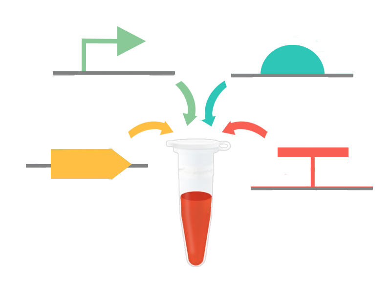
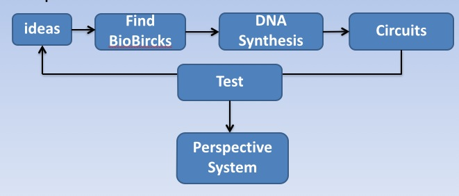

# igem

!SLIDE

# How to Mess Up a Project

## [Jianhong Li](http://omegaga.net)
Sun Yat-sen University

!SLIDE

# How to Mess Up a Project and Win World Champion

## [Jianhong Li](http://omegaga.net)
Sun Yat-sen University

!SLIDE

### iGEM

The International Genetically Engineered Machine competition (iGEM) is the premiere undergraduate Synthetic Biology competition.

!SLIDE

### Synthetic Biology

* Synthetic biology is the design and construction of biological devices and systems. It is an area of biological research and technology that combines biology and engineering.

* It encompasses a variety of different approaches, methodologies, and disciplines with a focus on engineering biology and biotechnology.

!SLIDE

# Some Examples

!SLIDE

## iPSC
2012 Nobel Prize in medicine. Adult cells could be reprogrammed into immature stem cells capable of developing into any living tissue.

!SLIDE

## Craig Venter
Creation of Man-made life. Digitize genome sequence information and create new cells that are controlled only by the synthetic chromosome with expected phenotypic properties and are capable of continuous self-replication.

!SLIDE

## Programming language for DNA
University of Washington develops new programming language could code DNA to deliver drugs and detect diseases. The language lets them write equations for DNA in code that can be used to test new drugs and medical treatments. In theory, the language could program DNA molecules to control our cells no differently than a rudimentary computer.

!SLIDE

To live, to err, to fall, to triumph, to recreate life out of life. 

!SLIDE

All things above have nothing to do with today's topic.

!SLIDE

### Computer Science in Synthetic Biology

* Standardization
* Process optimization
* Computer-aided design
* Visualizion and analysis on experimental data
* Simulation and prediction of experimental result

!SLIDE

# Basic Concepts

!SLIDE

## BioBrick

Standard biological parts are DNA sequences of defined structure and function.

	

!SLIDE

## General Procedure

	

!SLIDE

## Our Project

CAST Designer: Computer-Aided Synbio Tool, a project to address specific technical challenges in synthetic biology. The software can automatically perform the regulatory networks and gene circuits designing, modeling, vector designing and proposal build.

!SLIDE

# Brief Intro to the Project

!SLIDE

# How to Mess Up a Project

!SLIDE

* Casual decision on techniques
* Frequently changed requirements
* Badly organized team
* Carelessness on documentation and comment

!SLIDE

# How to Win World Champion

!SLIDE

* Nice idea and model
* A complete software, but not a set of toolkit
* Diligent programmer!

